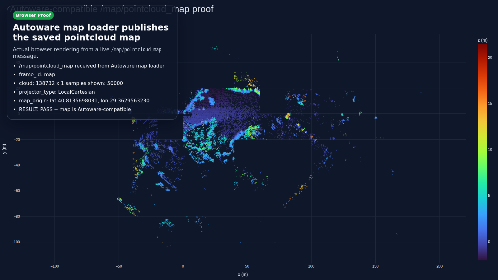

# lidarslam_ros2

[](https://github.com/rsasaki0109/lidarslam_ros2/actions/workflows/main.yml)
[](https://opensource.org/licenses/BSD-2-Clause)
[](#support-and-license)

ROS 2 LiDAR SLAM. Frontend is `RKO-LIO` (MIT), backend is `graph_based_slam` (BSD-2). Output is an Autoware-compatible `pointcloud_map/` directory plus `map_projector_info.yaml`. No GPL components on the default workflow.

## TOGO Rover SLAM/Nav

The rover-specific live SLAM and Nav2 workflow is documented in [docs/togo_slam_nav_overview.md](docs/togo_slam_nav_overview.md).

Primary commands inside the Docker workspace:

```bash
bash /ws/src/lidarslam_ros2/scripts/togo/run_live_seyond_slam_integrated.sh
bash /ws/src/lidarslam_ros2/scripts/togo/run_nav2_with_slam.sh
```

The old `/scripts/run_live_seyond_slam_integrated.sh` and `/scripts/run_nav2_with_slam.sh` commands still work as compatibility wrappers.

`develop` tracks the current v2 alpha line. Latest tagged public beta: [v0.2.2 Release Notes](docs/releases/v0.2.2.md).



## Install

```bash
cd ~/ros2_ws/src
git clone --recursive https://github.com/rsasaki0109/lidarslam_ros2.git
cd ..
rosdep install --from-paths src --ignore-src -r -y
colcon build --symlink-install --cmake-args -DCMAKE_BUILD_TYPE=Release
source install/setup.bash
```

If you cloned without `--recursive`: `git -C src/lidarslam_ros2 submodule update --init --recursive`.

## Quickstart

Downloads NTU VIRAL `tnp_01` (~580 s outdoor bag) and runs RKO-LIO + graph_based_slam end to end into an Autoware-loadable map.

```bash
cd src/lidarslam_ros2
bash scripts/download_ntu_viral_tnp01.sh
bash scripts/run_autoware_quickstart.sh
python3 scripts/verify_autoware_map.py output/.../pointcloud_map
```

`verify_autoware_map.py` prints `map_verify: PASS` when Autoware map loaders can open the result.

## Use your own bag

```bash
bash scripts/run_autoware_map_beginner.sh /path/to/rosbag2
```

Or invoke the launch files directly:

```bash
ros2 launch lidarslam rko_lio_slam.launch.py \
  bag_path:=/path/to/rosbag2 \
  lidar_topic:=/os_cloud_node/points \
  imu_topic:=/os_cloud_node/imu
ros2 service call /map_save std_srvs/srv/Empty
```

Required topics, optional GNSS / IMU pre-integration, and the dynamic-object filter parameters are documented in [docs/workflows.md](docs/workflows.md).

## Features

- Loop closure with built-in Scan Context (GPL-free), plus opt-in BEV / SOLiD / STD/BTC-style Triangle descriptors and optional 3D-BBS verification.
- Optional GNSS georeferencing; writes `map_projector_info.yaml` for direct Autoware loading.
- AWSIM → Autoware autonomous-driving demo on the map you build, including lanelet2 auto-generation from the SLAM trajectory.
- Save-time dynamic-object filter and NIS-driven adjacent-edge auto-scaling.
- Benchmark + release-gate tooling with per-dataset thresholds and report helpers.

## AWSIM autonomous-driving pipeline

```bash
bash scripts/test_awsim_setup.sh
bash scripts/run_awsim_selfmade_map_demo.sh
```

Multi-terminal bringup and lanelet2 notes: [docs/awsim-autonomous-driving-tutorial.md](docs/awsim-autonomous-driving-tutorial.md).

## Benchmarks

```bash
bash scripts/run_rko_lio_graph_benchmark.sh
bash scripts/run_release_readiness_checks.sh --fail-on-profiles
```

Per-dataset pass / target thresholds live in `scripts/release_profiles.yaml`. Details and optional MID-360 / production-bundle gates: [docs/benchmarking.md](docs/benchmarking.md).

## Docs

- **Getting started**: [Autoware quickstart](docs/autoware-quickstart.md) · [Operator workflows](docs/workflows.md) · [Autoware Foxglove](docs/autoware-foxglove.md)
- **Pipelines**: [AWSIM autonomous-driving tutorial](docs/awsim-autonomous-driving-tutorial.md) · [Autoware-compatible map authoring](docs/autoware-map-authoring.md)
- **Benchmarking**: [Benchmarking and release gate](docs/benchmarking.md) · [Comparison](docs/comparison.md)
- **Project**: [v0.2.2 release notes](docs/releases/v0.2.2.md) · [Contributing](CONTRIBUTING.md) · [Changelog](CHANGELOG.md) · [Releasing](RELEASING.md)

Preview the doc site locally: `python3 -m mkdocs serve`.

## Support and license

| ROS 2 distro | Ubuntu | Scope |
| --- | --- | --- |
| Humble | 22.04 | default workflow build + package tests in CI |
| Jazzy  | 24.04 | default workflow build + package tests in CI; Autoware dogfood exercised locally |

`graph_based_slam` is BSD-2-Clause; `RKO-LIO`, `DLIO`, and the optional vendored `3D-BBS` are MIT; `FAST_GICP` is BSD-3-Clause; built-in Scan Context is implemented locally. The default workflow excludes GPL-only components — `Thirdparty/lio-sam` and `Thirdparty/3d_bbs` are gated by `COLCON_IGNORE`.

## Quality gates

```bash
bash scripts/run_default_ci_checks.sh
bash scripts/run_release_readiness_checks.sh --ape-threshold 0.10
```

Reference commands and parameter pointers live in [docs/workflows.md](docs/workflows.md).
