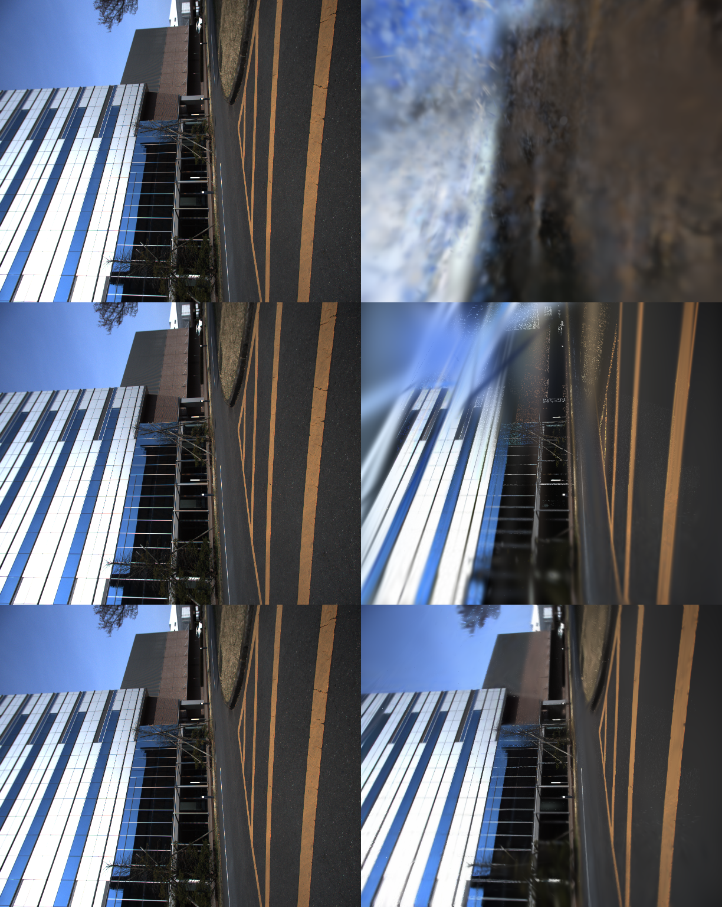

# 3DGS koide first light (2026-06-06)

`docs/research/3dgs-postprocess-map-design.md` の M1 first light を、ローカルの
`demo_data/koide_lidar_camera_calib`（Livox + 単眼カメラ同期 bag）で実走した記録。
**実 bag → SLAM → posed 画像 → 3DGS `.ply` の全鎖が通った**ことの確認。

再現: `bash scripts/run_koide_3dgs_firstlight.sh`

## パイプライン

```
demo_data/koide_lidar_camera_calib/livox/rosbag2_2023_03_09-13_42_46  (15.6s)
  │
  ├─[1] lidarslam frontend (mid360 noimu)  → traj_map_livox_frame.tum  (30 poses)
  ├─[2] extract_posed_images.py            → 30 posed images + transforms.json
  │        --time-offset auto (camera→/livox/points クロック整合: 21.88s)
  │        --extrinsic 近似 frame-convention (並進ゼロ)
  └─[3] train_gsplat.py (gsplat, 60k init, 1500 iter) → point_cloud.ply (4.1MB)
```

## 結果（3段階の品質向上）

| 指標 | random init | + LiDAR-primed | + **densification** |
|---|---|---|---|
| 学習 photometric MSE | 0.035 | 0.0082 | **0.0024** |
| レンダ PSNR（view 0/15/29） | 14.6 / 15.1 / 14.7 | 20.7 / 20.1 / 20.8 | **25.4 / 22.9 / 26.1 dB** |
| gaussians | 60k | 200k | 220k（適応増加）|
| iter | 1500 | 1500 | 3000 |

共通: 入力 30 views（2448×2048, fl_x≈1453）／ RTX 4070 Ti SUPER ／ gsplat 1.5.3。



- **LiDAR-primed init**（設計の核）で +5.5dB。`build_lidar_init.py` が bag のスキャンを
  SLAM 軌跡で world 系に蓄積（151 scans → voxel 0.05 → 200k 点）し、
  `train_gsplat.py --init-ply` が Gaussian 位置（＋色）を seed。COLMAP SfM 不要で
  メートル単位の幾何事前が入る。
- **densification**（`--densify`, gsplat `DefaultStrategy`）でさらに +4.3dB。
  adaptive density control で Gaussian を増減し細部を鮮鋭化。**最終 PSNR ~24.8dB**、
  render は太陽光パネル列・建物エッジ・橙色フレームまで GT にほぼ一致。
  ※短い run では opacity reset が逆効果なので `reset_every` を無効化している。

`random → LiDAR-primed → densify` で **PSNR 15 → 20.5 → 24.8dB**、設計の方向性が
実データで裏付けられた。**さらに SH deg1 + 学習 iter を 9000〜15000 に伸ばすと 25.2〜25.5dB**
まで到達する（当初 ~24dB を上限と見ていたが一部は under-training だった、
`3dgs-sh-degree-notes.md`）。再現スクリプトの既定もこのベスト構成（SH deg1 / iter 9000）。

## extrinsic 自己校正の検証（負の結果）

「近似 extrinsic が残ブラーの主因」という仮説を検証するため、`train_gsplat.py
--optimize-extrinsic` を実装した。extrinsic 誤差は**全カメラ共通の単一 6-DoF rigid
補正**（`c2w_true = c2w_approx @ Δ`）なので、学習可能な SE(3) 補正を gaussian と同時に
photometric 最適化すれば lever-arm/回転を復元できる（photometric BA）。

結果: 復元された補正は**回転 ~0.24°・並進 z ~10cm と微小**で、refined-pose 評価の
PSNR は ~24dB と densify-only と**同等（向上なし）**。
→ **koide のフレーム規約 extrinsic は既にほぼ最適**で、残ブラーの主因ではなかった。
self-cal 機能自体は extrinsic が未知/不良な bag で有用なので残すが、koide では
デフォルト無効。

## さらなる改善レバー（効果順、更新）

1. **視点数・系列長** — 30 views / 15s 単一セグメントが実質の上限要因。複数 koide
   セグメント結合や長い軌跡で view を増やすのが最も効くと推定。→ 別データ(isuzu 640views)で
   **検証したが視点増では破れず**（`3dgs-isuzu-viewcount-notes.md`）。pose 一貫性が本丸。
2. **frontend-only odometry のドリフト** — graph backend OFF。backend ON / ループ補正。
3. **損失関数** — ~~現状 MSE のみ~~ → **実装済み**（下記 §知覚レバー）。INRIA 標準
   L1+D-SSIM を `--ssim-lambda`（既定 0.2）で追加。
4. **scale init** — ~~一様スケール~~ → **実装済み**。`--knn-scale-init` で点群の局所
   密度（k-NN 間隔）から per-Gaussian スケールを seed。
5. **LiDAR init の色付け** — ~~位置のみ seed~~ → **実装済み**（`build_lidar_init.py
   --color-transforms`、画像投影で点群を着色）。**ただし品質は中立**: koide で 3000iter
   23.6dB（位置のみ 23.8dB と同等）、500iter でも差なし。色は LR が高く <100iter で学習
   され、早期は densification が律速のため init 色は冗長。機能は検査用/非 densify/下流
   用途に残すが、PSNR レバーとしては効かない。
6. 長 run（iter 増）。

（extrinsic は §上記のとおり koide では頭打ち。他データセットでは効く可能性あり。）

## 知覚レバー（SSIM 損失 + k-NN scale init）の A/B（2026-06-06）

同条件（densify 3000 iter、LiDAR-primed init、学習ビュー評価）で損失と init を変えて計測。
PSNR/SSIM は `train_gsplat.py` が学習終了時に全ビューで算出。

| 条件 | 損失 | scale init | PSNR | SSIM | gaussians |
|------|------|-----------|------|------|-----------|
| A | MSE のみ（旧既定） | 一様 | **24.29 dB** | 0.8123 | 220k |
| B | L1+D-SSIM (λ=0.2) | 一様 | 23.79 dB | 0.8412 | 370k |
| C | L1+D-SSIM (λ=0.2) | k-NN | 23.77 dB | **0.8435** | 360k |

- **SSIM 損失で構造類似度 +0.029**（k-NN init で更に +0.0023、計 +0.031）。エッジ・
  パネル列のシャープネスが上がる（`assets/3dgs_koide_ssim_compare.png`、列は GT | MSE | SSIM）。
- 代償は **PSNR -0.5dB**。MSE は PSNR を直接最適化するため当然で、SSIM はそれと
  トレードオフ。**PSNR の ~25dB 上限は破れない＝ data-bound**（30 視点・単一短セグメント）。
- 結論: SSIM 損失は**標準 INRIA loss なので既定採用**（知覚品質が上がる）。k-NN init は
  原理的に正しいが効果は限界的なので **opt-in**。上限突破には依然「視点数・系列長」が本丸。

## わかったこと（実運用の知見）

- **LiDAR とカメラがセンサ内蔵クロックの別基準**だった（header stamp が ~21.9s ずれ）。
  bag 受信時刻で skew を相殺する `--time-offset auto` を実装して解決。同種の Livox+cam
  bag で再利用可能。
- `cv_bridge` は当環境の numpy 2.4.4 で ImportError。`sensor_msgs/Image` を numpy 生
  復号（`decode_image`）して回避済み。

## 次アクション

- (A) `train_gsplat` に **LiDAR-primed init**（pointcloud_map / scan 点群からの Gaussian
  初期化）と densification を追加 → 品質の本丸。
- (B) koide の **正規 extrinsic**（direct_visual_lidar_calibration）を入れて再評価。
- (C) NTU VIRAL（ステレオ + GT）で pose 品質と 3DGS 品質の相関を見る（設計 doc M2）。
